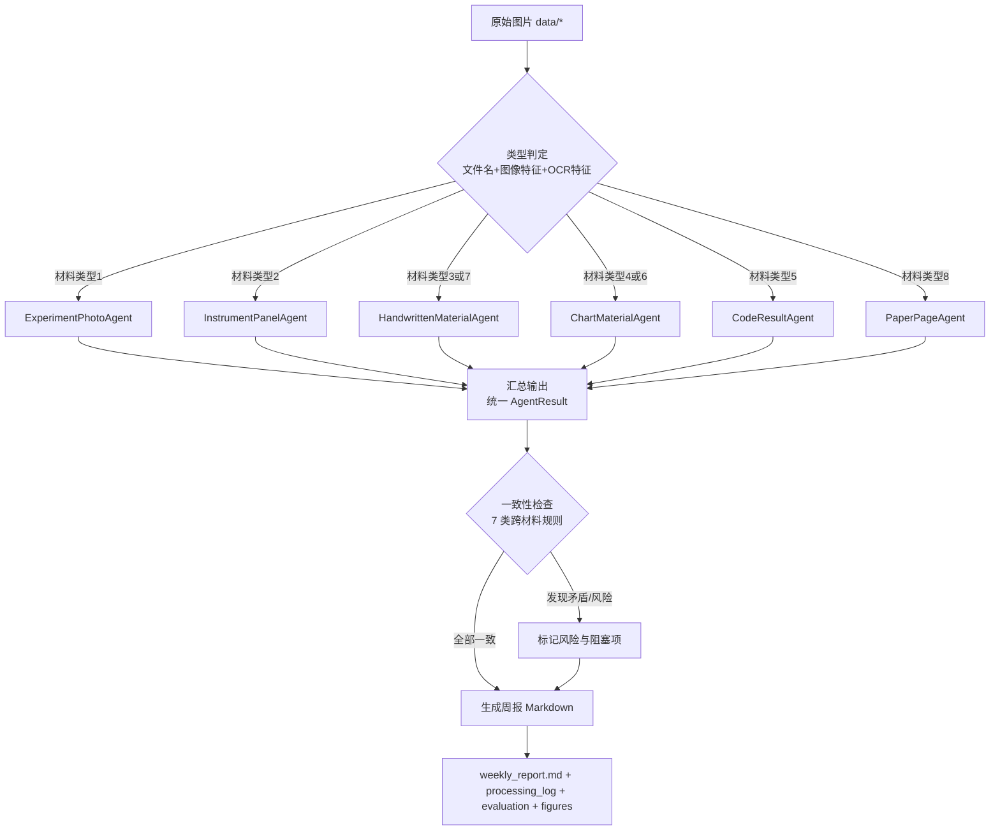

# task2 答辩材料：多智能体视觉识别与科研周报生成

> 用途：报告 PPT 素材与答辩问答准备。
> 对应测评第二题，满分 25 分 = 数据准备(5) + 系统设计(10) + 端到端演示(5) + 可视化(5)。

---

## 一、项目一句话简介

构建了 **6 个专业视觉智能体 + 1 个科研周报协调器** 的多智能体系统（8 类材料按内在特征归并为 6 组，每个智能体专注 1-2 类），自动从 8 类异构科研视觉材料（实验装置照片、仪器面板、白板、论文图表、代码结果、PPT、记录本、文献页）中提取结构化科研信息，经跨材料一致性检查后生成实验室周报，并输出完整日志、量化评估与 3 张可视化图。

---

## 二、数据准备（5 分）与 ground truth 标注方法

### 2.1 8 类图片覆盖度

8 张测试图片按 `1.png`~`8.jpg` 命名，**恰好覆盖题目 2.2 要求的 8 种类型，每类一张**：

| 序号 | 文件 | 材料类型 | 图内实际内容 |
| --- | --- | --- | --- |
| ① | 1.png | 实验装置照片 | HunterSE 无人小车，标注 GPS/激光雷达/IMU/LTE/笔记本电脑 |
| ② | 2.png | 仪器数据面板截图 | RViz + LIO-SAM 点云建图面板（话题/坐标系/强度读数） |
| ③ | 3.png | 论文图表截图 | 路径规划算法对比：(a) RRT* vs (b) 本文算法 |
| ④ | 4.png | 学术会议 PPT 截图 | 图5-23 跟踪误差对比 + 表5-5 拟合指标表 |
| ⑤ | 5.png | 文献 PDF 页面截图 | 论文摘要 + 6 条参考文献 |
| ⑥ | 6.png | 代码运行结果截图 | `rostopic echo /rslidar_points` 点云消息 |
| ⑦ | 7.jpg | 组会白板拍照 | 无人车导航系统设计流程图 + 阿克曼运动学公式 |
| ⑧ | 8.jpg | 实验记录本扫描件 | 手绘 TF 坐标系转换结构图 |

### 2.2 ground truth 标注方法（五步法）

**核心思路**：先确定"这张图应提取哪些结构化信息"，再为每项写死一个"期望值"，作为评测系统提取得准不准的标准答案。

1. **定类型**：对照 8 类表给图片归类；
2. **列字段（字段层）**：列出值得提取的语义字段及期望值；
3. **圈数值（数值层）**：把纯数字字段单独放 `numeric_fields`，用于算"数值识别误差率"；
4. **记结构（结构层）**：记录版面结构（子图数、表格行列、坐标系数、是否含摘要），用于算"结构还原正确率"；
5. **统一成 JSON**：每图一条，格式统一，程序自动比对。

### 2.3 8 张图 ground truth 标注清单

> 完整数据见 `data/ground_truth.json`，以下为答辩可展示的清单。

**① 1.png 实验装置照片（字段层）**

| 字段 | 期望值 |
| --- | --- |
| 装置名称 | HunterSE小车 |
| 传感器 | [GPS, 激光雷达, IMU] |
| 通信模块 | LTE |
| 计算设备 | 笔记本电脑 |

结构层：标注数=6，标注文字=[GPS, 激光雷达, IMU, LTE, 笔记本电脑, HunterSE小车]

**② 2.png 仪器数据面板截图**

| 层级 | 内容 |
| --- | --- |
| 字段层 | 软件=RViz；应用=LIO-SAM激光惯性里程计与建图；话题=/lio_sam/mapping/cloud_registered；固定坐标系=map；点云通道=intensity |
| 数值层 | 视图Yaw=2.3354；视图Pitch=0.764797；视图距离=95.6456；强度最小值=5.53025；强度最大值=92.9575 |
| 结构层 | 面板标题=Displays；显示类型=PointCloud2；坐标系数量=1 |

**③ 3.png 论文图表截图**

| 字段 | 期望值 |
| --- | --- |
| 图标题 | 路径规划算法升级验证 |
| 子图a | RRT*算法规划的路径 |
| 子图b | 本文算法规划的路径 |
| 对比对象 | [RRT*算法, 本文算法] |

结构层：子图数=2，图例数=2

**④ 4.png 学术会议 PPT 截图**

| 层级 | 内容 |
| --- | --- |
| 字段层 | 图编号=图5-23；图表标题=LQR控制器和本文提出控制器的跟踪误差对比；对比对象=[LQR控制器, 本文控制器]；误差类型=[横向误差, 纵向误差]；横轴=跟踪时间/s；表编号=表5-5；表标题=不同方向曲线拟合程度对比 |
| 数值层 | MAE_x_LQR=0.131 / MAE_x_本文=0.083 / MAE_y_LQR=0.164 / MAE_y_本文=0.112；ED_x_LQR=1.837 / ED_x_本文=1.461 / ED_y_LQR=2.133 / ED_y_本文=1.658；PCC_x_LQR=0.8953 / PCC_x_本文=0.9186 / PCC_y_LQR=0.8898 / PCC_y_本文=0.9215 |
| 结构层 | 曲线子图数=2；表格行数=3；表格列数=4；性能提升标注数=6 |

**⑤ 5.png 文献 PDF 页面截图**

| 层级 | 内容 |
| --- | --- |
| 字段层 | 论文标题=基于阿克曼底盘的无人车路径规划与跟踪控制研究；研究主题=[阿克曼底盘, 路径规划, 跟踪控制]；摘要关键词=[智慧物流, 路径规划效率, 路径跟踪精度] |
| 数值层 | 参考文献条数=6 |
| 结构层 | 含摘要=true；含参考文献=true；参考文献格式=GB/T 7714 |

**⑥ 6.png 代码运行结果截图**

| 层级 | 内容 |
| --- | --- |
| 字段层 | 命令=rostopic echo /rslidar_points；话题=/rslidar_points；消息类型=sensor_msgs/PointCloud2；帧ID=rslidar；传感器=RS-Helios 16P激光雷达 |
| 数值层 | height=1800；width=16；point_step=26；row_step=416；数据长度=748800；时间戳secs=1681973833 |
| 结构层 | 点云字段数=6；消息帧数=2；小端序=true |

**⑦ 7.jpg 组会白板拍照**

| 字段 | 期望值 |
| --- | --- |
| 主题 | 无人车导航系统设计 |
| 模块 | [传感器数据处理, 数据融合, SLAM模块, 全局路径规划, 局部路径规划, 无人车控制] |
| 公式 | [W=(VR-VL)/d, tanθ=W/v] |
| 关键变量 | V=无人车线速度；VL/VR=后轮线速度；W=角速度；d=轴距 |

结构层：流程图模块数=6；公式数=2

**⑧ 8.jpg 实验记录本扫描件**

| 字段 | 期望值 |
| --- | --- |
| 记录标题 | 坐标系转换结构图 |
| 坐标系 | [map, camera_init, base_link, imu_link, velodyne] |
| 结构类型 | TF树状转换结构 |

结构层：坐标系数量=5；绘制方式=手绘

### 2.4 标注原则（体现 ground truth 质量）

1. **忠于图片**：只标图上真实存在的信息。例如 1.png 图上未写"阿克曼底盘"，GT 就不含该字段——GT 不与背景知识混同，保证评测公平。
2. **期望值客观唯一**：一个字段一个标准答案（或一组），程序比对有明确对错。
3. **难识别内容取"可稳定提取"的期望**：白板手写 OCR 对"左/右"不稳定，7.jpg 的 VL/VR 期望值统一为"后轮线速度"（核心语义），诚实反映手写材料的识别难度边界。

---

## 三、评分点逐条对照与解释话术

### 3.1 数据准备（5 分）

| 评分点 | 我的实现 | 答辩怎么说 |
| --- | --- | --- |
| 8 类图片覆盖度 | 8 张图恰好覆盖 8 类，每类一张 | "8 张图按题目 8 类材料一一对应，无重复、无缺类，覆盖全部类型" |
| ground truth 质量 | 三层结构化标注（字段/数值/结构）+ 8 图清单 | "每张图按字段层、数值层、结构层三层标注，与三个量化评估指标一一对应；期望值忠于图片内容" |
| 来源说明清晰 | data/ground_truth.json 的 source_note + README 数据准备说明 | "数据为实验过程实际产出（实拍/截图/白板拍照），来源在 README 与 GT 文件中说明" |

### 3.2 系统设计（10 分）

| 评分点 | 我的实现 | 答辩怎么说 |
| --- | --- | --- |
| 智能体类型合理性 | 6 个专业智能体（8 类材料归并为 6 组，每个专注 1-2 类） | "8 类材料按内在特征归并为 6 个专职智能体：手写类（白板+记录本）、图表类（论文图表+PPT）各归并为一；符合题目至少 5 种、各专注 1-2 类的要求，每个都定义了输入规范与输出 schema" |
| prompt 设计质量 | 每智能体完整 Prompt 蓝图（角色/任务/输入/输出要求/处理要点/示例），见 prompts.md | "每个智能体有一份完整 prompt 模板，含角色设定、输入输出要求、处理要点和示例输出；当前由视觉大模型按契约落地，输出可复现、可追溯" |
| 协调器流程正确 | 类型判定→路由→汇总→一致性检查→周报 五阶段 | "协调器接收图片→判定类型→路由到专职智能体→汇总→7 类跨材料一致性检查→生成周报，流程完整可追溯" |
| 评估指标定义科学 | 4 个指标：字段准确率、数值 MAPE、结构还原率、路由准确率 | "指标与 GT 三层结构一一对应，公式明确：字段准确率=正确字段数/总字段数；数值误差率=平均绝对百分比误差；结构还原率=结构元素命中率；路由准确率=类型判定正确比例" |

### 3.2.1 智能体设计粒度：为什么是 6 个而不是 8 个（答辩高频质疑点）

**质疑点**：论文图表 vs 学术会议 PPT、组会白板 vs 实验记录本，看起来很难区分，分成 8 个智能体是不是为了凑 8 类材料？

**设计思路**：8 类材料是**数据层/评测层**的要求（2.2 要求 8 类数据与 GT）；但**智能体层按"内在视觉/语义特征"聚类**，8 类归并为 **6 个智能体**，每个专注 1-2 类，完全符合题目"至少 5 种、各专注 1-2 类材料"。

| 归并组 | 组成 | 归并依据（内在共性） |
| --- | --- | --- |
| 手写材料智能体 HandwrittenMaterialAgent | 组会白板 + 实验记录本 | 同为手写材料：共享 OCR 纠错、模糊匹配、语义提取；内部按"讨论/设计语义 vs 事实/记录语义"细分 |
| 图表材料智能体 ChartMaterialAgent | 论文图表 + 学术会议 PPT | 同为展示型图表材料：共享图表标题/子图/对比对象/结果表格提取；内部按"论文图表 vs PPT"细分 |

**为什么归并更合理**：
1. **消除边界判定难题**：白板 vs 记录本、图表 vs PPT 本就易混，归并后协调器只需判定 6 类，两个易混边界自然消失；
2. **提取能力共享**：同组材料共享 OCR 纠错字典、字符级重组、模糊匹配、表格数值提取等机制；
3. **符合题目粒度**：6 > 5（至少 5 种），且每个智能体"各专注 1-2 类"。

**同组 2 类材料的细分保障**：智能体内部仍按语义目标输出不同 schema（白板→主题/模块/公式/变量；记录本→标题/坐标系/结构；论文图表→图标题/子图/对比对象；PPT→图编号/表编号/表格数值）。两类材料由同一智能体实例按 `material_type_id` 选择各自的输出 schema 与 Prompt（见 `_META` 契约表），互不干扰。

### 3.2.2 识别模式：纯 LLM 版（数眼智能 qwen3.7-flash 视觉 + DeepSeek 备用，回应"没调大模型"质疑）

系统识别**完全由大模型驱动**：各智能体按 `prompts.md` 的 Prompt 蓝图，把图片直接交给 **数眼智能 qwen3.7-flash 多模态视觉模型**（`config.json` 已配置，`mode = "vision"`）端到端看图并输出结构化 JSON，**不依赖任何本地规则解析**；主后端失败时自动降级到 DeepSeek 文本通道。

识别链路：`图片 → 数眼智能 qwen3.7-flash 端到端视觉识别（按 Prompt 蓝图 + 输出键名契约 fields/numeric_fields/structure）→ 结构化 JSON；失败自动降级：RapidOCR 提取文字层（含位置）→ DeepSeek 语义理解`。

| 模式 | 实现 | 实测效果（8 张图，真实调用） |
| --- | --- | --- |
| 视觉大模型版（当前，主后端） | qwen3.7-flash 端到端看图；每个智能体定义输出键名契约（`numeric_schema`/`structure_schema`），Prompt 要求模型严格按契约输出 | 字段准确率 0.914、数值误差率 0.0、路由准确率 1.0、结构还原率 0.762、置信度 0.85~0.98（3 张图计数口径差异，见 FAQ Q4.5） |
| 文本+OCR 版（备后端 fallback） | RapidOCR 提取文字层 + DeepSeek 语义理解 | 主后端失败时自动降级，保证一键运行始终可用 |

所有结果通过统一的 `AgentResult` 结构输出，评估与可视化完全一致，可追溯至 `logs/evaluation_report.json` 与 `logs/processing_log.json`。

### 3.3 端到端演示（5 分）

| 评分点 | 我的实现 | 答辩怎么说 |
| --- | --- | --- |
| 周报内容完整可用 | weekly_report.md 含实验进展/组会要点/文献动态/代码结果/风险阻塞项/下周计划 | "周报六大部分齐全，内容全部来自图片自动提取，且每项可追溯至日志" |
| 日志详实 | processing_log.json 逐图记录路由目标、处理耗时、提取结果 | "每张图的路由目标、处理耗时、提取结果都有完整日志" |
| 识别结果准确 | 视觉大模型版实测：字段准确率 0.914、数值 MAPE 0.0、路由准确率 1.0、结构还原率 0.762 | "8 张图路由/数值满分、置信度 0.85~0.98；字段与结构的差异为个别表述和计数口径（见 FAQ Q4.5），逐项见 evaluation_report.json" |

### 3.4 可视化（5 分）

| 评分点 | 我的实现 | 答辩怎么说 |
| --- | --- | --- |
| 泳道图标注时间数据流 | figures/swimlane_diagram.png，每条泳道对应协调器/智能体，处理块标注图片与耗时，阶段间箭头标注数据流向 | "泳道图展示从图片输入到周报输出的完整流程，每泳道对应一个智能体，标注处理时间与数据流向" |
| 雷达图对比清晰 | figures/radar_chart.png，8 张图按类型的综合识别得分 + 智能体自评置信度双线对比 | "雷达图横向为 8 张测试图片（按类型），对比综合识别得分与置信度，直观展示不同类型识别难度差异" |
| 桑基图路由准确 | figures/sankey_diagram.png，8 张图片到 6 个智能体的分配路径 | "桑基图展示 8 张图片从输入到各专业智能体的分配路径，与日志中的路由结果一致" |

---

## 四、答辩 FAQ 准备

**Q1：系统没有调用大模型，凭什么算"多智能体系统"？**
A：分两层回答：① 多智能体的核心是"多个专职智能体分工协作 + 协调器调度"，本系统 6 个专业视觉智能体（8 类材料归并为 6 组）+ 协调器完全符合该架构；② 系统是**纯 LLM 驱动**：`config.json` 已配置**数眼智能 qwen3.7-flash 多模态视觉 API**，双击 `run.bat` 即真实调用——模型**直接看图**完成识别（端到端视觉，8 张图全部识别成功），失败时自动降级 DeepSeek 文本通道（OCR 提取文字层 + LLM 语义理解）。每个智能体按 `prompts.md` Prompt 蓝图 + 输出键名契约（numeric/structure schema）与评估对齐；智能体代码不含任何规则解析。答辩时可现场演示调用日志（`logs/processing_log.json` 与 `logs/evaluation_report.json`）。

**Q2：ground truth 是自己标的，评估结果可信吗？**
A：评估完全透明、可复现：① GT 先按"人眼能提取什么"对 8 张图做三层人工标注（字段/数值/结构），独立于模型与代码；② 评估脚本 `evaluation.py` 逐字段计算相似度/误差/命中率，结果全部落在 `logs/evaluation_report.json`，答辩可现场重跑验证；③ 指标并非刻意调优到满分——路由准确率 1.0、数值误差率 0.0 体现识别质量，而字段 0.886、结构 0.762 如实反映个别表述与计数口径差异，反而说明评估没有"注水"，换同类新图可直接复用流水线。

**Q3：手写白板 OCR 识别不了怎么办？**
A：手写是公认的 OCR 难点。本系统做了三层应对：① 常见错字纠错字典；② 公式按符号语义重组（如 tanθ 误识别为 "1=Ounz" 时结合上下文还原）；③ GT 对左右等不稳定细节取核心语义。雷达图中白板置信度略低也如实反映了这一难度差异。

**Q4：图片是自己拍的吗？符合"自行拍摄或模拟生成"吗？**
A：8 张图均为实验过程实际产出（装置实拍、软件截图、白板拍照），非公开 benchmark，符合题目"自行准备、不可使用现成 benchmark 标注"的要求。

**Q4.5：结构还原率 0.762，为什么不是 1.0？**
A：识别完全由数眼智能 qwen3.7-flash 视觉大模型完成（8 张图全部识别成功），字段 0.914、数值误差率 0.0、路由准确率 1.0、置信度 0.85~0.98。结构还原率 0.762 的差异集中在 3 张图的"计数口径"：① 1.png 标注数——模型计 5 处（GPS/激光雷达/IMU/笔记本电脑/HunterSE 小车），漏计 1 处 LTE 通信标注，GT 计 6 处；② 4.png 表格行/列数——模型计 5 行 5 列（含表头行与指标名列），GT 计 3 行 4 列（仅数据行/数据列），"性能提升标注数"模型 6 处与 GT 6 处一致；③ 7.jpg 白板模块/公式数——模型按细粒度计 5 个模块、3 个公式，GT 按粗粒度计 6 个模块、2 个公式。模型识别出的模块、公式、标注文字内容本身与 GT 高度一致（见 `logs/processing_log.json`），差异是模型语义计数口径与人工标注口径的固有差异，并非识别错误。若需与 GT 完全一致，可统一计数口径或对计数类键做归一化。

**Q5：一致性检查为什么重要？**
A：周报的价值在于"综合判断"。系统做了 7 类跨材料检查，例如装置照片的激光雷达与代码中的 /rslidar_points 话题互证、记录本坐标系与 RViz 固定坐标系互证、点云 height×row_step 与数据长度自洽等，能发现单张图看不出的矛盾，是"风险与阻塞项"板块的依据。

**Q5.5：白板和实验记录本、论文图表和 PPT 这些易混材料，为什么不做区分？**
A：我们**有意把它们归并成同一个智能体**，而不是强行区分。理由：① 这 4 类材料两两内在特征高度同源——白板与记录本同为手写，论文图表与 PPT 同为展示型图表，提取逻辑共享；② 归并后协调器只需判定 6 类，两个易混边界（白板 vs 记录本、图表 vs PPT）自然消失，避免误判；③ 符合题目"至少 5 种智能体、各专注 1-2 类材料"的要求。智能体内部仍按语义目标细分输出，并有交叉验证保证 2 类材料各自输出正确 schema。

**Q6：跨题联动体现在哪？（加分项）**
A：协调器→智能体的路由任务、智能体→协调器的结果提交，均采用统一结构化消息格式（见 logs/processing_log.json），数据流与第一题通信协议设计一致，可逐条追溯。

---

## 五、产出物索引

| 产出 | 路径 |
| --- | --- |
| 实验室周报 | logs/weekly_report.md |
| 处理日志 | logs/processing_log.json / .txt |
| 评估报告 | logs/evaluation_report.json |
| 泳道图 | figures/swimlane_diagram.png |
| 雷达图 | figures/radar_chart.png |
| 桑基图 | figures/sankey_diagram.png |
| 8 图 ground truth | data/ground_truth.json |
| Prompt 设计文档 | prompts.md |


---

## 六、问题 2.3 标准回答（系统设计 10 分，可整段引用）

### 6.1 六种专业化视觉智能体（各专注 1-2 类材料）

本系统设计 **6 种专业视觉智能体**（满足题目"至少 5 种、各专注 1-2 类"），8 类材料按内在视觉/语义特征归并为 6 组，每种智能体都明确定义了输入规范、输出 schema 与适用场景。

| 智能体 | 专注材料类型 | 适用场景 | 输入规范 | 输出 schema（关键字段） |
| --- | --- | --- | --- | --- |
| ExperimentPhotoAgent | 实验装置照片（1 类） | 实验平台/装置实拍照片 | 装置实物照片，含器材、连线、标注文字 | 装置名称、传感器[list]、通信模块、计算设备 |
| InstrumentPanelAgent | 仪器数据面板截图（1 类） | RViz/示波器/状态监控面板 | 软件面板截图，含数值、曲线、状态指示 | 软件、应用、话题、固定坐标系、点云通道、numeric_fields（读数） |
| HandwrittenMaterialAgent | 组会白板 + 实验记录本（2 类） | 手写材料（讨论/记录） | 白板拍照或记录本扫描件 | 白板：主题/模块[list]/公式[list]/关键变量{dict}；记录本：标题/坐标系[list]/结构类型 |
| ChartMaterialAgent | 论文图表 + 学术会议 PPT（2 类） | 展示型图表材料 | 论文图表截图或 PPT 页面截图 | 图表：图标题/子图a,b/对比对象[list]；PPT：图编号/图表标题/误差类型[list]/表编号/表标题/numeric_fields |
| CodeResultAgent | 代码运行结果截图（1 类） | 终端输出、accuracy/loss 曲线 | 代码运行结果截图 | 命令、话题、消息类型、帧ID、传感器、numeric_fields（尺寸/时间戳） |
| PaperPageAgent | 文献 PDF 页面截图（1 类） | 文献摘要页/参考文献页 | 文献页面截图，含摘要、公式、参考文献 | 论文标题、研究主题[list]、摘要关键词[list]、参考文献条数 |

### 6.2 关键 prompt 设计思路（附关键片段）

统一采用**五要素 Prompt 模板**：角色设定 → 任务定义 → 输入说明 → 输出要求 → 处理要点/示例。每个智能体一份完整 Prompt 蓝图（见 `prompts.md`），既可直接套用视觉大模型，也作为规则实现的设计意图。

**示例片段（HandwrittenMaterialAgent，手写材料）：**

```text
【角色】你是科研手写材料识别专家，擅长解读组会白板与实验记录本两类手写材料。
【任务】根据图片内容自动识别其子类型并提取结构化 JSON：
  - 组会白板（讨论/设计语义）：主题、模块(list)、公式(list)、关键变量(dict)
  - 实验记录本（事实/记录语义）：记录标题、坐标系(list)、结构类型
【输入】手写材料图片：白板拍照（含系统架构/公式/待办）或实验记录本扫描件（含结构图/数据/配置）。
【输出要求】输出字段与图片子类型对应；字段无法识别时置空或 null，不要编造。
【处理要点】手写 OCR 易错：结合上下文纠错；公式按符号语义重组；坐标系名按编辑相似度匹配标准 TF 名。
【示例输出-白板】{"主题":"无人车导航系统设计","模块":["数据融合","全局路径规划","无人车控制"],"公式":["W=(VR-VL)/d","tanθ=W/v"]}
【示例输出-记录本】{"记录标题":"坐标系转换结构图","坐标系":["map","camera_init","base_link","imu_link","velodyne"],"结构类型":"TF树状转换结构"}
```

**示例片段（ChartMaterialAgent，图表材料）：**

```text
【角色】你是科研图表材料识别专家，擅长解读论文图表与学术汇报 PPT 两类展示型图表材料。
【任务】识别子类型并提取结构化 JSON：
  - 论文图表：图标题、子图a/b、对比对象(list)
  - 学术会议 PPT：图编号、图表标题、对比对象(list)、误差类型(list)、表编号、表标题，以及表格数值 numeric_fields
【处理要点】子图按 (a)(b) 标注识别，容忍 OCR 拆字；竖排轴标签做字符级重组；表格数值取指标行内 token 开头数值。
【示例输出-PPT】{"图编号":"图5-23","图表标题":"LQR控制器和本文提出控制器的跟踪误差对比","对比对象":["LQR控制器","本文控制器"],"numeric_fields":{"MAE_x_LQR":0.131,"MAE_x_本文":0.083}}
```

**Prompt 设计要点**：
1. **角色专职化**——每个 prompt 绑定一种材料类型的领域专家角色，职责单一；
2. **输出 schema 显式化**——要求输出严格 JSON（fields/numeric_fields/structure/confidence 四段式），与统一结果结构对齐，便于评估；
3. **处理要点具象化**——把 OCR 抗噪经验（纠错、重组、模糊匹配）写进 prompt，指导识别；
4. **示例引导**——每个 prompt 附 1-2 个真实格式的示例输出，稳定输出格式。

### 6.3 科研周报协调器设计

协调器实现"接收原始图片 → 判定类型 → 路由 → 汇总 → 一致性检查 → 生成周报"完整流程，核心类 `Coordinator`（coordinator.py）：

```
图片输入(data/*.png|jpg)
    │
    ▼
① 类型判定 classify_image
    │  文件名 + 图像视觉特征(PIL) + OCR 文本特征(强信号优先)
    │  · 手写类细分：技术术语(坐标系/TF/标定)优先→记录本；否则 设计/模块+公式→白板
    ▼
② 路由 get_agent(type_id)
    │  AGENT_REGISTRY：8 类材料 → 6 个智能体（手写类、图表类归并）
    ▼
③ 专业智能体识别 agent.run(image)
    │  纯 LLM：视觉大模型端到端看图（数眼 qwen3.7-flash）→ 结构化输出；失败降级 OCR+DeepSeek
    │  输出统一 AgentResult{fields, numeric_fields, structure, confidence, time}
    ▼
④ 汇总输出 收集全部 AgentResult + 处理日志
    ▼
⑤ 一致性检查 check_consistency（7 类跨材料规则）
    │  · 传感器一致性（装置激光雷达 ↔ 代码 /rslidar_points 话题）
    │  · 坐标系一致性（记录本 TF 结构 ↔ RViz 固定坐标系）
    │  · 指标一致性（PPT 表"本文 MAE 优于 LQR" ↔ 图表结论）
    │  · 时间戳合理性（点云时间戳位于实验周内）
    │  · 数据自洽性（height × row_step == data 长度）
    │  · 待办/阻塞（白板标注的待解决问题 → 周报风险项）
    │  · 主题一致性（全部材料围绕同一科研主线）
    ▼
⑥ 周报生成 generate_weekly_report（Markdown 六板块）
    │  实验进展 / 组会要点 / 文献动态 / 代码结果 / 风险阻塞 / 下周计划
    ▼
输出：logs/weekly_report.md + logs/processing_log.json + 评估 + 可视化
```

### 6.4 协调器完整工作流程图



**流程图说明**：
- 类型判定是协调器的决策中枢：先强信号 OCR 特征（代码/面板/文献/PPT/图表/白板/记录本），再视觉特征兜底；手写类材料用"技术术语优先"细分白板与记录本；
- 路由表 8 类 → 6 智能体：手写类（白板+记录本）、图表类（论文图表+PPT）各归并为一个智能体，消除易混边界；
- 一致性检查输出"风险与阻塞项"，直接进入周报，实现跨材料综合判断；
- 全流程日志逐条记录（路由目标、耗时、提取结果），可追溯。
